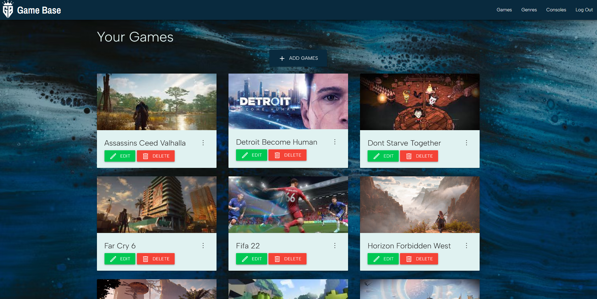
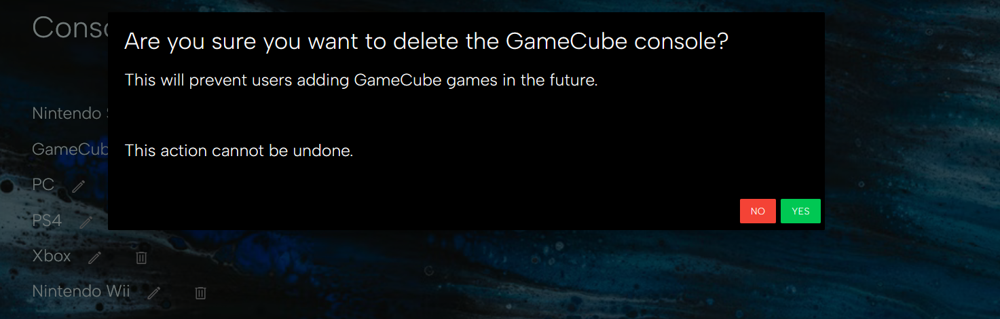

# Game Base

This website allows gamers to keep a record of games that they want to play in the future. 
As a gamer, you often talk to your friends about the games that they're playing and in passing you may hear of cool games that you want to play in the future. Have you ever been in a situation where you are ready to start a new game but you can't quite remember the name of that one particular game that a friend of a friend recommended 2 months ago? Well, Game Base would be perfect for you! It's a quick and simple way of creating a 'to-play' list! Never feel uncertain of what game to play next with Game Base.

To visit the website, please visit the deployed site [here](https://gamebase-storage.herokuapp.com/).

***

## User Stories

As a user of the Game Base website, I want to:
  1. keep a record of games I want to play in the future
  2. be able to add games to my Game Base
  3. browse through the games I've added to my Game Base
  4. be able to edit the games on my Game Base
  5. be able to remove games from my Game Base
  6. sort the games I've added to my Game Base by category
  7. view basic information of the games on my Game Base 
  8. log into my Game Base with my email address and password

***

## UX

### Colour Scheme
- A calming blend of teal shades and rich blues. This gives a cool and clean look.
    >
- No accessibility issues were returned when passing the colour scheme through the official [WebAIM](https://webaim.org/resources/contrastchecker/).
    >

### Typography

- Google Fonts
  Font styles were taken from the open source [Google Fonts](https://fonts.google.com/).
  - the typography for the text throughout the website is [Albert Sans](https://fonts.google.com/specimen/Albert+Sans). This font design was inspired by the type-characteristics of scandinavian architects and designers in the early 20th century. It gives a clean and fresh look to the website. 
  - The typography for the brand logo is font-family [Archivo Narrow](https://fonts.google.com/specimen/Archivo+Narrow?preview.text=Game%20Base&preview.text_type=custom#standard-styles). This font was originally designed for highlights and headlines. This family is reminiscent of late nineteenth century American typefaces. As such, it is eye-catching to the user.

***

### Wireframes

- Home wireframe

 

 - Genres wireframe

 

 - Mobile browse wireframe

 

 

***

## Database Model
- Database schema for Game Base

 

***

## Features 

### Existing Features 

__Login__

  - This is the page that first loads when a user visits the website. It allows users to log into their GameBase with their email address and password that they set up during registration.
  - If a user has not yet registered, there is a link to the registration page so they may do so.
  - The log in page contains the navbar, however, if a user tries to navigate to a page (e.g., the games page) without having logged in beforehand they will be unable to do so and directed to log in.
  - If a user logs in with an invalid email and/or password they will be informed and unable to login.
  - The logout button on the navbar has been hidden and disabled as the user is not logged in.

  

__Register__

  - A user will navigate to this page to create their GameBase account. Once a GameBase account has been created a user will be able to login using their email and password to access the main site content.
  - The user will not be able to create an account if the email provided is already assigned to a GameBase account. If this is attempted the user will be informed.
  - The logout button on the navbar has been hidden and disabled as the user is not logged in.

  

__Navbar__

  - Once logged in, a user will be able to navigate throughout the website via the navbar.
  - The navbar consists of the website logo (left) and four buttons (right). The buttons navigate the user to the games page, genres, page, consoles page, or logout the user.

  

__Mobile Navbar__

  - Once logged in, a user will be able to navigate throughout the website via the navbar.
  - The navbar consist of the website logo (right) and an expandable burger menu (left) which contains four buttons. The buttons navigate the user to the games page, genres, page, consoles page, or logout the user.

  
  
  When burger menu is expanded:

  

__Games__

  - The games page displays all the games the user has saved to their GameBase (in alphabetical order).
  - The add game button navigates the user to the add game form (see below).
  - Each game has its own card and displays a game image (if provided by the user). If no image is provided or if a broken url is provided by the user then a default placeholder will be displayed. The game card shows the game title (truncated if the title exceeds 27 characters), an edit game button which directs the user to the edit game form (see below) and a delete game button which results in the delete game modal pop up (see below). When the user clicks on the card area or the kebab icon, the game information content will display (see below).

  

__Add Game__

  - Clicking the '+ add game' button on the games page will navigate the user to the add game form. 
  - The form requires users to input a game title, select a game genre from the drop-down and provide a release date. The user may also chose to provide details on the game's developer, what console(s) the game can be played on, if the game is singleplayer or not, and finally provide an image url - for aesthetic display.
  - The user will not be able to create a new instance of a game record if the title already exists in their collection of games i.e., a user will not be able to have duplicate entries of one game.
  - Once the user clicks 'add game' and all the required fields have been filled, the game record is added to the database and the game will be displayed on the users Games tab (above).

  

__Edit Game__

  - When the green 'edit game' button is clicked on a game's card, the user will be directed to the edit game form.
  - This form will auto-fill with the current values that are saved for that game.
  - As is the same when adding a game,  the edit form requires users to input a game title, select a game genre from the drop-down and provide a release date. The user may also chose to provide details on the game's developer, what console(s) the game can be played on, if the game is singleplayer or not, and finally provide an image url - for aesthetic display.
  - Once the user clicks 'update' the game record will be updated to the new information provided. This will then be displayed.
    - The edit game feature also has defensive programming to prevent users editing a game that is not theirs.

  

__Delete Game__

  - When a user clicks the red 'delete' button on a game card, this triggers a modal to pop-up. The modal asks the user if they're certain they wish to delete the chosen game. Having a modal pop-up prevents accidental deletion. 
  - The modal has a question phrased "are you sure you want to delete this game?" and reminds the user that the deletion can not be undone. There are two options, 'No' which does nothing and closes the modal, or 'Yes' which will delete the game if selected.
  - The delete game feature also has defensive programming to prevent users deleting a game that is not theirs.

  

__Game Information__

  - Interacting with a game card or clicking the kebab icon will reveal the game information. This is a display of the full title (even if truncated on the card cover) and any information the user has saved for that game.
  - Clicking the close icon will close the game information overlay.

  
  

__Genres__

  - The genres page displays the user's games by genre. Genres are listed alphabetically. Genres can not be edited by a user, only an admin can edit/delete genres and consoles (see admin features).
  - The game cards and game buttons work as explained above.
  - There is a message at the bottom of the genres list: "Current genre list, please [contact the administrator](https://github.com/antonia-white/game-base/issues) for alterations or additions" - informing the user that they can not alter the games genre list and must contact the administrator (in this case, a direction towards the GameBase repo's issues, for demonstrative purposes). If a user wanted an addition or change to the list, they must open an issue and the admin would have to go and implement the change/addition if appropriate.

  

__Consoles__

  - The console page displays the current console list, telling a user which consoles they can select for their games. The console list can not be edited by a user, only an admin can edit/delete consoles (see admin features).
  - There is a message at the bottom of the consoles list: "Current console list, please [contact the administrator](https://github.com/antonia-white/game-base/issues) for alterations or additions" - informing the user that they can not alter the games genre list and must contact the administrator (in this case, a direction towards the GameBase repo's issues, for demonstrative purposes). If a user wanted an addition or change to the list, they must open an issue and the admin would have to go and implement the change/addition if appropriate.

  

### Admin Features

Only the admin has controls to edit and delete genres and consoles. For assessment purposes, the admin is the user that is able to log into GameBase with the email address "admin@admin.com". This could of course be changed if the website was to take genuine use. All admin features also have defensive programming to prevent a user brute forcing admin privileges.

__Admin Genres View__

  - The admin's genres page includes an '+ add genre' button. When clicked this will navigate the admin to the add genre form (see below).
  - Each genre has two associated buttons - Edit and Delete buttons. These have subtle hover styling as seen on the edit action button in the picture below.
  - When the edit button is clicked, the admin will be greeted with the edit genre form (see below).
  - When the delete button is clicked, this will trigger the delete genre modal to pop-up (see below). 

  

__Add Genre__

  - The add genre form has a single input field for genre name.
  - Once the 'add genre' button is clicked, this will add the genre record to the database. All users will now be able to select this genre for their games and see this genre in their genres list in the genres tab.

  

__Edit Genre__

  - The edit genre form title reminds the admin which genre they are currently editing.
  - The edit genre form has a single input field for genre name.
  - Once the 'update genre' button is clicked, this will update the genre record with the new details to the database. All users will now have this genre updated for their games and see this updated genre in their genres list in the genres tab.

  

__Delete Genre__
  - When the admin clicks the 'delete' button for a genre, this triggers a modal to pop-up. The modal asks the admin if they're certain they wish to delete the chosen genre. Having a modal pop-up prevents accidental deletion. 
  - The modal has a question phrased "are you sure you want to delete the [Genre Name] genre?" and reminds the admin that this will delete all games associated to this genre for __all__ GameBase users and reminds that the deletion can not be undone. There are two options for the question, 'No' which does nothing and closes the modal, or 'Yes' which will delete the genre and all associated games if selected.

  

__Admin Console View__

  - The admin's consoles page includes an '+ add console' button. When clicked this will navigate the admin to the add console form (see below).
  - Each console has two associated buttons - Edit and Delete buttons. These have subtle hover styling.
  - When the edit button is clicked, the admin will be greeted with the edit console form (see below).
  - When the delete button is clicked, this will trigger the delete console modal to pop-up (see below). 

  

__Add Console__

  - The add console form has a single input field for console name.
  - Once the 'add console' button is clicked, this will add the console record to the database. All users will now be able to select this console for their games and see this console in the consoles list.

  

__Edit Console__

  - The edit console form title reminds the admin which console they are currently editing.
  - The edit console form has a single input field for console name.
  - Once the 'update console' button is clicked, this will update the console record with the new details to the database. All users will now have this console updated for their games and see this updated console in the consoles list.
  - 

  

__Delete Console__

  - When the admin clicks the 'delete' button for a console, this triggers a modal to pop-up. The modal asks the admin if they're certain they wish to delete the chosen console. Having a modal pop-up prevents accidental deletion. 
  - The modal has a question phrased "are you sure you want to delete the [Console Name] console?" and reminds the admin that this will prevent users from assigning a game to this console in the future and reminds that the deletion can not be undone. There are two options for the question, 'No' which does nothing and closes the modal, or 'Yes' which will delete the console. This console will now not be visible in the console list.
  - 

  

### Features Left to Implement 

- Have consoles input field autofill with stored values when trying to edit a game 
  - With additional time I would implement this feature by migrating the consoles database to a relational DBMS or relate MongoDB ObjectID's by converting the ObjectId to a time stamp, as seen [here](https://steveridout.com/mongo-object-time/)

***

## Technologies
- [HTML](https://en.wikipedia.org/wiki/HTML) was used as the markup language
- [CSS](https://en.wikipedia.org/wiki/CSS) was used for custom styling
- [JavaScript](https://en.wikipedia.org/wiki/JavaScript) was used for custom website interactivity
- [GitPod](https://gitpod.io) was used as a cloud based iDE
- [GitHub](https://github.com/) was used to manage the Git repository
- [Heroku](https://gamebase-storage.herokuapp.com/) was used for deployment
- [Git](https://git-scm.com/) was used for version control
- [MongoDB](https://www.mongodb.com/) was used as a database management system
- [PostgreSQL](https://www.postgresql.org/) was used as a database management system
- [Jinja](https://jinja.palletsprojects.com/en/3.1.x/) was used as a web template engine for Python
- [Flask](https://flask.palletsprojects.com/en/2.1.x/) python web framework used to create routes
- [Python](https://www.python.org/downloads/) used as a dependency for Flask
- [Psycopg2](https://www.psycopg.org/docs/) was used as a database driver to connect to the PostgreSQL database
- [Pip3](https://pip.pypa.io/en/stable/) was the package manager used to install the dependencies
- [Materialize](https://materializecss.com/) was used for website layout and responsive components
- [Google Fonts](https://fonts.google.com/) was used to provide website fonts and icons
- [Am I Responsive](http://ami.responsivedesign.is/) was used to generate a mock-up image
- [Dev Tools](https://en.wikipedia.org/wiki/Web_development_tools) was used for testing and responsiveness
- [Lucidspark](https://lucidspark.com/) was used for creating wireframes and schema diagrams

***

## Testing

To view all testing documentation, refer to [TESTING.md](TESTING.md).

***

## Deployment

The site was deployed to Heroku. The live link can be found [here](https://gamebase-storage.herokuapp.com/)

The steps to deploy a Heroku app are as follows: 
1.  Log in to Heroku or create an account if required.
2.  Create a Heroku app - select 'New', from the drop-down menu select Create New App. The app name provided must be unique.
3.  Select a region.
4.  Create.
5.  Navigate to the Resources tab and add a Heroku PostgreSQL database.
6.  Access the Settings Tab and find the Config Vars. For this project you will need the following config vars:
    *   MONGO_DBNAME = the name of your mongo database.
    *   MONGO_URI = the uri for your mongo database.
    *   DATABASE_URL = the url of your heroku postgres database.
    *   SECRET_KEY = a secret key for your app.
    *   PORT = 5000
    *   DEBUG = set to 'True' during development and 'False' upon deployment.
    *   IP = Your IP address

  Please see this [official documentation](https://devcenter.heroku.com/articles/config-vars) on Heroku configuration for more details.

7.  Navigate to the Deploy tab.
8.  Select Github as the deployment method.
9.  Follow steps to link to the appropriate GitHub account.
12. If you wish, enable Automatic Deploys for automatic deployment when you push updates to Github. Or alternatively, select the correct branch for deployment from the drop-down menu and click Deploy Branch for manual deployment.

Final steps: 
1. Create a Procfile in your repository containing `web: python run.py` so that Heroku will identify the app as a Python app.
2. Create an untracked file called env.py in your repo and input the config vars you previously established in Heroku.
3. Create a requirements.txt file
    - If you want to freeze your own packages into this file, run `pip3 freeze --local > requirements.txt` in the console.
    - To install only the packages that are already listed in the GameBase repo requirements (if making a local copy/clone) run `pip3 install -r requirements.txt` in the console.

### Cloning

Cloning a repository makes it easier to contribute, fix merge conflicts, add or remove files, and push larger commits. To clone this repository from GitHub to a local computer use the following steps:

1.  On GitHub, navigate to the main page of the repository.

2.  Above the list of files, click Code.

3.  Click Use GitHub CLI, then the copy icon.

4.  Open Git Bash and change the current working directory to the location where you want the cloned directory.

5.  Type git clone, and then paste the URL that was copied from step 3 above - i.e., `git clone https://github.com/antonia-white/game-base.git`

6. Press Enter to create the local clone.

### Forking
A fork is a copy of a repository. Forking a repository allows you to freely experiment with changes without affecting the original project.

To fork this project go to the top left of the repository, where you see the Fork Icon and click Fork.  This will create a copy of the repository for you.

## Credits 

### Content 

- All text throughout the website is self-written.
- Multiple useful articles at [w3schools](https://www.w3schools.com/)
- Various snippets of code adapted from helpful posters on [Stack Overflow](https://stackoverflow.com/)
- The official documentation for [Jinja](https://jinja.palletsprojects.com/en/3.1.x/templates/)
- Example combined database [repository](https://github.com/Code-Institute-Solutions/CombinedTaskManager2022) provided by Code Institute was used as a guide

### Media
- The background image was taken from the open source site [Unsplash](https://unsplash.com/)
- The image placeholder when a user doesn't input a link to an image or if the url provided is broken was taken from the open source site [Placeholder.com](https://placeholder.com/)

### Acknowledgements

- My Code Institute mentor, [Tim Nelson](https://github.com/TravelTimN)
- My friends and family for manually testing the site.

***
