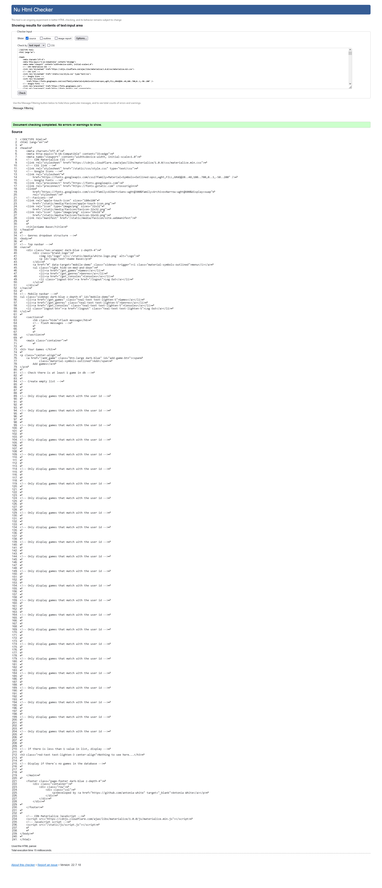

# Testing 

***

## Validator Testing 

- HTML
  - No errors were found in the `login.html` file when passed through the official [W3C's HTML Validator](https://validator.w3.org/#validate_by_input)).

    >

  - No errors were found in the `register.html` file when passed through the official [W3C's HTML Validator](https://validator.w3.org/#validate_by_input)).

    >

  - No errors were found in the `games.html` file when passed through the official [W3C's HTML Validator](https://validator.w3.org/#validate_by_input)).

    >

  - No errors were found in the `add_game.html` file when passed through the official [W3C's HTML Validator](https://validator.w3.org/#validate_by_input)).

    >

  - No errors were found in the `edit_game.html` file when passed through the official [W3C's HTML Validator](https://validator.w3.org/#validate_by_input)).

    >

  - No errors were found in the `genres.html` file when passed through the official [W3C's HTML Validator](https://validator.w3.org/#validate_by_input)).

    >

  - No errors were found in the `add_genre.html` file when passed through the official [W3C's HTML Validator](https://validator.w3.org/#validate_by_input)).

    >

  - No errors were found in the `edit_genre.html` file when passed through the official [W3C's HTML Validator](https://validator.w3.org/#validate_by_input)).

    >

  - No errors were found in the `consoles.html` file when passed through the official [W3C's HTML Validator](https://validator.w3.org/#validate_by_input)).

    >

  - No errors were found in the `add_console.html` file when passed through the official [W3C's HTML Validator](https://validator.w3.org/#validate_by_input)).

    >

  - No errors were found in the `edit_console.html` file when passed through the official [W3C's HTML Validator](https://validator.w3.org/#validate_by_input)).

    >


- CSS
  - No errors were found in the `style.css` file when passed through the official [Jigsaw validator](https://jigsaw.w3.org/css-validator/#validate_by_input) CSS validator.
  
    >


- JavaScript
  - No errors were found when `script.js` was passed through the official [JSHint](https://jshint.com/) JavaScript validator.

    >


- Python
  - No errors were returned and all code met PEP8 compliance when `__init__.py` file was passed through the official [pep8online](http://pep8online.com/) Python validator.

    >


  - No errors were returned and all code met PEP8 compliance when `models.py` file was passed through the official [pep8online](http://pep8online.com/) Python validator.

    >


  - No errors were returned and all code met PEP8 compliance when `routes.py` file was passed through the official [pep8online](http://pep8online.com/) Python validator.

    >

  - No errors were returned and all code met PEP8 compliance when `run.py` file was passed through the official [pep8online](http://pep8online.com/) Python validator.

    >

***

### Fixed Bugs

I used the built-in [GitHub Issues](https://github.com/antonia-white/game-base/issues) tracker for tracking any active bugs during development. 


Here are the issues tracked that have been closed and working as intended:

- PSQL connection error [#1](https://github.com/antonia-white/game-base/issues/1)
- password value too long for type character varying(25) [#2](https://github.com/antonia-white/game-base/issues/2)
- 'is_singleplayer' is not defined [#3](https://github.com/antonia-white/game-base/issues/3)
- class 'builtins.dict' is not mapped [#4](https://github.com/antonia-white/game-base/issues/4)
- 'BaseQuery' object has no attribute 'id' [#5](https://github.com/antonia-white/game-base/issues/5)
- local variable 'Genre' referenced before assignment [#6](https://github.com/antonia-white/game-base/issues/6)
- Invalid input syntax for type integer [#7](https://github.com/antonia-white/game-base/issues/7)
- 'list' object has no attribute replace [#8](https://github.com/antonia-white/game-base/issues/8)
- invalid input for type 'date' [#9](https://github.com/antonia-white/game-base/issues/9)

***

## Unfixed Bugs 

To the best of my knowledge, there are no unfixed-bugs.

***

## Browser Compatability

- Website launched successfully on [Firefox](https://www.mozilla.org/en-GB/firefox/new/):

  >

- Website launched successfully on [Google Chrome](https://www.google.com/intl/en_uk/chrome/):

  >

- Website launched successfully on [Microsoft Edge](https://www.microsoft.com/en-us/edge):

  >

***

## Responsiveness

- Website viewed on a mobile device:

  >

- Website viewed on a tablet device:

  >

- Website viewed on a laptop device:

  >


***

## User Story Testing

A target user of the Game Base website will want to:
- [x] keep a record of games I want to play in the future
   >The Game Base website allows users to store games
- [x] be able to add games to my Game Base
   >Users can add games to the Game Base database
   >
- [x] browse through the games I've added to my Game Base
   >Users can see the games they have added in the Game Base website
   >
- [x] be able to edit the games on my Game Base
   >Users can edit their own games when logged into the Game Base website
   >
- [x] be able to remove games from my Game Base
   >Users can delete their own games when logged into the Game Base website
   >
- [x] sort the games I've added to my Game Base by genre
   >Users can view their games by genre in the genres tab of the Game Base website
   >
- [x] view basic information of the games on my Game Base 
   >Users can store and view information they have inputted about their games
   >
- [x] log into my Game Base with my email address and password
   >After registering, a user is able to login to their Game Base
   >

***

## Defensive Programming Testing
- Continuous checks throughout the application test if there is a current user in session. If there is no user in session, there is redirection to the login page. For example, as seen in the get games route:
  ```
  if "user" not in session:
        flash("Please login")
        return redirect(url_for("login"))
  ```
- There is defensive programming in place so that a user can only edit and delete games that belong to them. This was acheived by setting the session user to equal the individual's id from the user table in the gamebase database. If the session user matches the id of the person who created the game, then edit and delete actions are allowed. If the session user does not match the id, the user will be alerted and redirected to login. For example, as seen in the edit game route:
  ```
  if session["user"] != Game.query.get_or_404(game_id).user_id:
        flash(
            "This is not your game! \
            You can only edit your own games. Please log in.")
        return redirect(url_for("login"))
  ```
- There is defensive programming to ensure only an admin can create, edit or delete records of genres and consoles. This is acheived by querying if the session user (i.e., the user id of the user currenty logged in) is equal to the user id of the account that has the email address "admin@admin.com". If these do match up then admin priveleges are allowedm otherwise the user will be alerted and redirected. For example, as seen in the edit console route:
  ```
  if session["user"] != User.query.filter(
                User.email == "admin@admin.com").first().id:
        flash("You must be admin to add a console.")
        return redirect(url_for("get_consoles"))
  ```